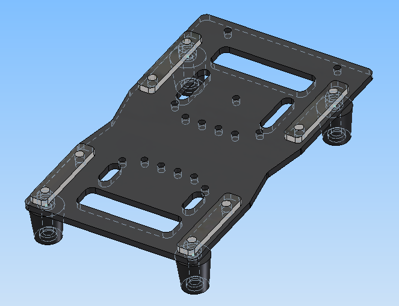

# 3D design

This is 3D designs for a foot. The files were created using Autodesk Inventor
2015 CAD software. If you are student, you can get a free version here:
http://www.autodesk.com/education/free-software/all

This design can be used as a reference or "as-is", if you decide to buy the
same gauges.

## Sourcing the gauges

The design is based on [Strain gauges](https://en.wikipedia.org/wiki/Strain_gauge).
You can buy the sensor itself separately, and also find it with mechanical
(mostly aluminium) shaft, we recommend this last option since it's not expansive
and already guarantee to have a correct bending.

The first thing you'll need is to get gauges fitting your needs, we used 5kg
nominal, which is about the maximum weight that they should have to hold
separately.

You can buy low-cost ones from AliExpress,
eBay or any general purpose market place.

There is different gauges out there, we recommend suing
differential ones (featuring wheatstone bridge arrangement, 4 wires). 

## Cells of this design

The cells in this design are [40 kg nominal, made of steel with 2 M4 holes with
27mm spacing](https://www.aliexpress.com/item/2-pc-40kg-Portable-weighing-sensor-weight-sensor-micro-bridge/32717418536.html).

## Foot part

The `foot.ipt` represents the foot plate, we recommend adjusting
the holes to fix it to the rest of your robot.

When printing it, you may fill this part with a reasonable amount of material.

[Continue through the docs with electronics »](../electronics)
