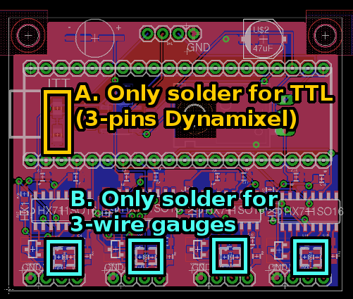
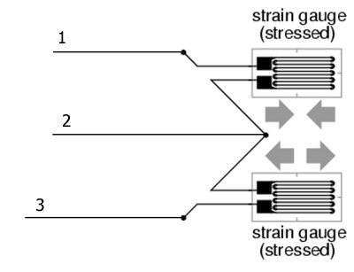
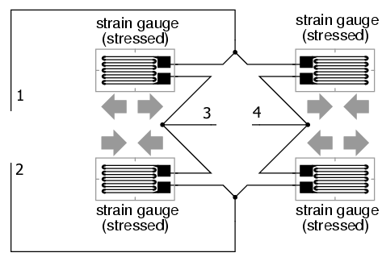

# Electronics

Here you'll find the schematics and (auto)routed board for sampling the gauge and communicate
through the dynamixel bus.

## Options

Some optional resistors on this board can be used to support dynamixel TTL/485 and 3/4 wire
gauges:

### Dynamixel RS485 or TTL

The two resistors (see yellow zones above) are only required if you want to use TTL Dynamixel.
In this case, you can solder a 3-pin connector on the dynamixel zone and it will do the job.

Actually, the A pin of the RS485 transciever is exactly the same as TTL when driving the line.
this change brings the B pin at VCC/2 (which should be 2.5V), so that when listening an high
A is 2.5V above B and a low A is 2.5V below B, which meets the RS485 requirements and makes
the MAX485 (or ST485) chip able to listen TTL, while perfectly respecting its specifications.

### 3-wire or 4-wire gauges

There is two main kind of mounting, half-bridges, which looks like that:

Here, there is three wire, so you'll have to compare the voltage value to 2.5V, this is why you
should solder the resistors (see cyan part of the above image) which will bring A- to V+/2 and
solder the third wire to A+.

The another option is a full-bridge:

We recommend this system since it is more accurate and robust. You'll have to solder the two
wires to A- and A+. The order of soldering doesn't really matter, since it will only affect the
sign of the measured value.

## Components

Here's a list of components you'll need to build the board with example links for buying them

### Controller

* ATmega328p
* 16 Mhz HC49US quartz

### Resistors (all are 0805 package)

* 22 ohms
* 3 Kohms
* 8.2 Kohms
* 20 Kohms

### Capacitors (all are 0805 package)

* 1uF
* 0.2uF
* 22 nF

### Polar capacitor, for decoupling

* EEE1CA470SP: 47uF
* EEEFK1C221XP: 220uF

### Power 

You can buy a 7805, but we recommend using a switching instead, like the TRACO TSR 1-2450
to avoid intensive heating.

### ICs

The amps are HX711, a really widespread chip that is use in weight scales
This chips regulates the reference voltage for the amp, using an external
PNP transistor (SOT-23 package). S8550 or BC857B,215 can be used.

### Connectors for jauges

You can use any 1.5mm pitch connector you like. We recommend the
[JST-ZH 4P](https://fr.aliexpress.com/item/40-SETS-Mini-Micro-ZH-1-5-4-Pin-JST-Connector-with-Wires-Cables/32612842708.html?spm=2114.13010608.0.0.3bLgYh).

Note that the order of the pins, from left to right are:

    GND VCC A B

Which corresponds typically on cells to:

    BLACK RED WHITE GREEN

If you use only half bridge, do not connect the 3rd (white) pin, and solder the two
resistors that can apply VCC/2 on it.

[Continue through the docs with the firmware »](../firmware)
